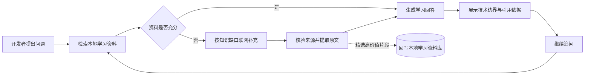

<div align="center">

# DevGuide

**面向开发者的技术栈学习 Agent**

从官方文档与优质开源项目出发，生成有依据、可追问、可复用的技术学习引导。

[](https://openjdk.org/)
[](https://spring.io/projects/spring-boot)
[](https://vuejs.org/)
[](https://github.com/pgvector/pgvector)
[](docs/需求确认书与开发计划.md)
[](LICENSE)

[核心能力](#核心能力) · [工作流程](#工作流程) · [技术栈](#技术栈) · [项目结构](#项目结构) · [快速开始](QuickStart.md)

</div>

---

## DevGuide 是什么

DevGuide 是一个围绕“如何学习一项开发技术”构建的 Web Agent。它不仅给出搜索结果，还会先组织技术栈的官方入口与高质量开源项目，再结合本地学习资料和联网证据，生成带来源、可核对的学习回答。

项目希望解决三个常见问题：资料入口分散、回答缺少出处，以及一次性问答难以延续。DevGuide 将技术栈发现、资料检索、学习引导和知识沉淀串成一条完整链路。

## 核心能力

| | 能力 | 说明 |
|---|---|---|
| **技术栈发现** | 动态识别与收录 | 支持预置清单和自由输入；新名称经过软件技术实体准入、官方来源核验与分类后才会转正。 |
| **优质项目导航** | GitHub Star Top 10 | 围绕当前技术栈检索高关注度开源项目，展示语言、Star、简介与仓库入口。 |
| **有依据的学习对话** | 本地优先 RAG | 每次提问先检索本地学习资料，由 Agent 判断资料是否覆盖问题关键点，不足时再按缺口联网。 |
| **可核对的引用** | 链接与来源原文 | 回答保留技术适用范围、具体来源链接和对应原文，不将模型总结伪装成资料。 |
| **连续学习** | 多轮追问与流式反馈 | 页面保留当前会话历史，支持折叠、追问、SSE 进度和断流后的内容保留。 |
| **知识增长** | 精选资料回写 | 实际用于回答的联网原文经 Agent 筛选后异步入库，限制数量并复用重复内容。 |
| **用户体系** | GitHub OAuth | 支持 GitHub 登录，并对用户 Token 进行加密保存与失效降级。 |

## 系统架构

```text
开发者
  └─ Vue 3 前端
      ├─ 技术栈浏览与详情
      └─ 连续学习对话
          │
          │ HTTP / SSE
          ▼
      Spring Boot API
          ├─ 技术栈发现 ─── 官方来源核验 · GitHub Top 10
          │                  └─ GitHub API · Tavily
          ├─ Agent 编排 ─── ResearchAgent · GuideAgent
          │                  └─ DeepSeek
          ├─ 本地优先 RAG ─ 检索 · 引用 · 资料回写
          │                  └─ DashScope Embedding
          ├─ 用户体系 ───── GitHub OAuth · Token 管理
          └─ 数据层 ─────── PostgreSQL · PGvector
```

前端通过 HTTP 获取技术栈与用户数据，通过 SSE 接收学习过程和回答；后端负责资料发现、Agent 编排、鉴权与知识库读写。技术栈发现使用 GitHub 与 Tavily，Agent 使用 DeepSeek 完成判断和生成，RAG 使用 DashScope 生成向量。

## 工作流程



本地检索负责复用已经沉淀的知识，联网补充只处理当前证据缺口；两类资料最终使用统一的引用结构交给回答生成阶段。

## 技术栈

| 层级 | 技术 | 在 DevGuide 中的作用 |
|---|---|---|
| 前端 | Vue 3、Vue Router、Vite | 技术栈浏览、详情展示、连续对话与 SSE 消费 |
| 后端 | Java 21、Spring Boot 3 | Web API、业务编排、认证与配置管理 |
| AI 框架 | Spring AI、Spring AI Alibaba | 模型接入、Tool Calling、向量检索与 MCP 能力 |
| Agent | ReAct、ResearchAgent、GuideAgent | 工具选择、资料充分性判断、研究与回答生成 |
| 模型 | DeepSeek、DashScope Embedding | 学习回答、结构化判断与文本向量化 |
| 数据 | PostgreSQL、PGvector、Flyway | 业务数据、学习资料、向量索引与数据库迁移 |
| 数据访问 | MyBatis-Plus | 用户、Token 与技术栈数据访问 |
| 外部资料 | GitHub API、Tavily、Jsoup | 仓库检索、联网搜索与来源正文提取 |
| 鉴权 | Spring Security、GitHub OAuth2 | 登录、会话与用户 Token 管理 |

## 项目结构

```text
DevGuide/
├─ backend/          Spring Boot 后端、数据库迁移与测试
├─ frontend/         Vue 3 前端、组件与单元测试
├─ docs/             需求、阶段记录、问题与验收文档
├─ design-system/    项目界面设计规范
├─ scripts/          本地开发脚本
├─ CONTEXT.md        统一业务术语与关系
└─ QuickStart.md     环境配置、启动与验证指南
```

## 项目状态

当前版本已经完成 MVP 核心链路：技术栈查询与动态转正、GitHub Top 10、本地优先 RAG、联网补充、引用与资料回写、连续追问及 GitHub OAuth。

后续工作集中在浏览器视觉验收、生产级鉴权、完整 Docker Compose 部署、多实例会话和高并发验证。详细状态以 [需求确认书与开发计划](docs/需求确认书与开发计划.md) 和 [M6.5 测试与验收](docs/M6.5-动态转正与界面优化/测试与验收.md) 为准。

## 文档

- [快速开始](QuickStart.md)：环境准备、密钥配置、启动与测试。
- [项目上下文](CONTEXT.md)：业务术语、关系与边界。
- [需求与开发计划](docs/需求确认书与开发计划.md)：产品目标、里程碑与当前状态。
- [RAG 主流程需求](docs/requirements/PRD-rag-main-flow.md)：本地检索、联网补充、引用与回写规则。
- [M6.5 测试与验收](docs/M6.5-动态转正与界面优化/测试与验收.md)：自动化和真实接口验证记录。

## 来源与许可

DevGuide 自有代码采用 [MIT License](LICENSE)，Copyright © 2026 [Into7ou](https://github.com/Into7ou)。

项目参考并基于 Apache-2.0 许可的 `spring-ai-alibaba/examples` 进行定制开发。第三方代码继续遵循其原始许可证，来源、参考提交与许可证副本见 [THIRD_PARTY_NOTICES.md](THIRD_PARTY_NOTICES.md)。
